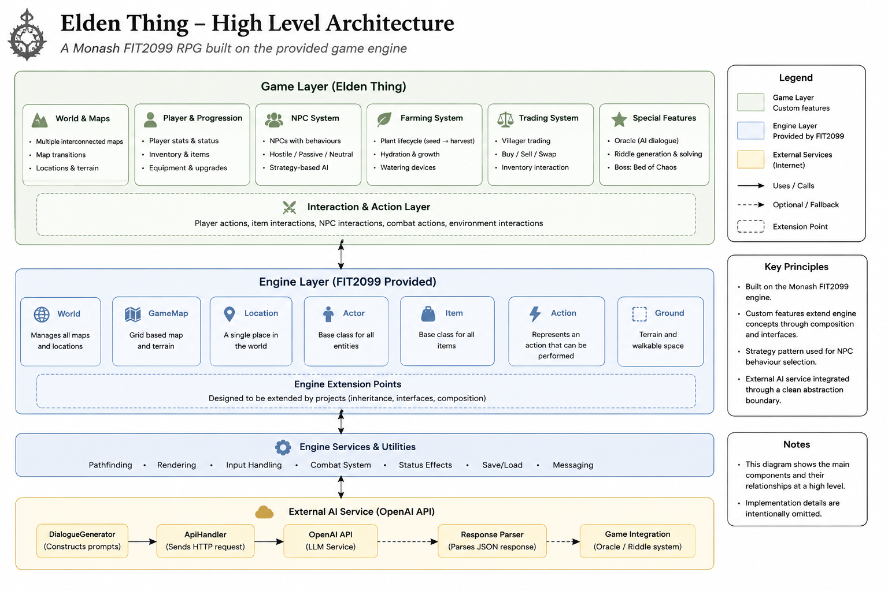

# Elden Thing — Java OOP Portfolio

A turn-based Java game project developed for **FIT2099 Object-Oriented Design and Implementation** at Monash University.

The original project was built on top of a **Java game engine provided by Monash University**. Rather than implementing the underlying engine from scratch, our team extended its existing abstractions — including `Actor`, `Action`, `Item`, `Ground`, `GameMap`, and `World` — to implement custom gameplay systems.

The project explores object-oriented design through NPC behaviour, combat, farming, trading, multiple maps, boss mechanics, and an AI-powered Oracle integrated with the OpenAI API.

> **Portfolio Notice**
>
> This repository is a portfolio showcase only.
> The university-provided engine, complete assessment source code, and original assignment solution are intentionally not published here.

---

## Architecture at a Glance



The project-specific game layer extends the existing FIT2099 framework rather than replacing it.

At a high level:

```text
FIT2099 Game Engine
        │
        ▼
Engine Extension Points
        │
        ▼
Game-Specific Layer
├── Actors
├── Actions
├── Behaviours
├── Behaviour Strategies
├── Farming
├── Watering
├── Trading
├── Combat
├── Oracle / Dialogue
└── World Configuration
```

More detailed architecture documentation is available in:

* [Architecture Overview](docs/architecture.md)
* [Design Decisions](docs/design-decisions.md)
* [Technical Reflection](docs/reflection.md)

---

## Project Highlights

The project includes several interacting gameplay systems:

* turn-based exploration
* reusable Action-based interactions
* NPC behaviour composition
* interchangeable NPC decision strategies
* combat and hostile actors
* farming and plant lifecycle
* manual and automatic watering
* creature reproduction
* trading and inventory interaction
* multiple maps and teleportation
* Bed of Chaos boss mechanics
* AI-generated Oracle dialogue
* interactive AI-generated riddles

The main engineering challenge was not simply implementing these features individually, but integrating them into an existing framework while keeping responsibilities separated.

---

## Tech Stack

* **Java**
* Object-Oriented Programming
* FIT2099 Game Engine
* Strategy Pattern
* Interfaces and Polymorphism
* Composition
* OpenAI Chat Completions API
* Java HTTP networking
* Streaming API responses
* UML / Software Design Documentation
* Git

---

# Working with an Existing Framework

The original codebase was separated into two main areas:

```text
src/
│
├── edu/monash/fit2099/engine/
│   └── Game engine provided by Monash University
│
└── game/
    └── Project-specific implementation
```

The engine already defined concepts such as:

```text
Actor
Action
Item
Ground
Location
GameMap
World
```

The game-specific implementation was built around these extension points.

This project therefore gave practical experience with a development workflow closer to:

```text
Understand Existing Codebase
        ↓
Identify Extension Points
        ↓
Design New Domain Logic
        ↓
Integrate with Existing Framework
        ↓
Preserve Compatibility
```

rather than building every layer from scratch.

---

# Action-Based Interaction Design

Gameplay interactions are represented using specialised Action objects.

Examples include concepts such as:

```text
AttackAction
BuyAction
SellAction
PlantAction
GrowAction
EatAction
CureAction
ReproduceAction
PropheciseAction
RiddleAnswerAction
```

This separates the actor performing an operation from the implementation of the operation itself.

```text
Actor
  ↓
Available Actions
  ↓
Selected Action
  ↓
Domain Operation
```

As new interactions are introduced, they can be represented as additional actions instead of continuously increasing the responsibilities of `Player` or NPC classes.

---

# NPC Behaviour Architecture

NPC decision making is separated from NPC entities.

Reusable behaviours include concepts such as:

```text
AttackBehaviour
FollowBehaviour
WanderBehaviour
ReproduceBehaviour
GrowBehaviour
DeathBehaviour
MonologueBehaviour
```

This allows NPCs to be composed from behaviours appropriate to their role.

A second abstraction controls how an NPC chooses between its available behaviours:

```text
BehaviourSelectionStrategy
├── PriorityBasedStrategy
└── RandomSelectionStrategy
```

This is a practical application of the **Strategy Pattern**.

The same creature type can therefore use different decision algorithms without changing its core implementation.

---

# Farming and Plant Lifecycle

The farming system models plants as stateful objects that change over time.

A simplified lifecycle is:

```text
Blighted Ground
      ↓
Healthy Soil
      ↓
Plant Seed
      ↓
Growing Plant
     ↙     ↘
 Watered   Dehydrated
    ↓          ↓
Harvest   Withered Soil
```

Plant types share common lifecycle concepts while retaining their own rules.

Examples include:

```text
Plant
├── InheritreePlant
└── BloodrosePlant
```

This provided experience modelling **state transitions and lifecycle-based domain logic**, rather than only static data structures.

---

# Watering System

Watering is separated from the plants themselves.

```text
WateringDevice
      │
      ├── ManualWateringDevice
      │       └── WateringCan
      │
      └── AutomaticWateringDevice
              └── Sprinkler
```

This separates:

```text
Plant
"What state am I in?"

from

WateringDevice
"How is water supplied?"
```

The design allows different watering mechanisms to evolve without requiring plant classes to understand every specific device.

---

# Combat and Creatures

The project contains both passive and hostile actors.

Examples include:

* Omen Sheep
* Spirit Goat
* Golden Beetle
* Merchant Kale
* Sellen
* Guts
* The Oracle

Combat-related responsibilities are separated through concepts such as:

```text
AttackBehaviour
      ↓
AttackAction
```

This keeps the decision to attack separate from the execution of an attack.

Some creatures also support reproduction through capability-oriented abstractions rather than requiring every Actor to contain reproduction logic.

---

# Bed of Chaos

The **Bed of Chaos** is a more complex boss represented using collaborating parts.

Conceptually:

```text
BedOfChaos
    │
    ├── Branch
    ├── Leaf
    └── GrowablePart
```

This provided an opportunity to use **composition** instead of putting all boss state and behaviour into one large class.

---

# Multi-Map World

The application supports multiple game maps, including:

```text
Valley of the Inheritree
        │
        ▼
Teleportation
        │
        ▼
Limveld
```

Map transitions reuse the engine's existing movement and `GameMap` abstractions rather than introducing a separate navigation framework.

This follows a general principle used throughout the project:

> Prefer extending existing framework concepts before creating parallel systems.

---

# AI-Powered Oracle

One of the more experimental parts of the project is **The Oracle**, an NPC connected to an external LLM API.

The Oracle supports several dialogue modes:

```text
PROPHECY
RIDDLE
COMPLIMENT
```

Dialogue generation is separated through:

```text
DialogueGenerator
├── ProphecyGenerator
├── RiddleGenerator
└── ComplimentGenerator
```

The high-level flow is:

```text
Player
  ↓
Oracle
  ↓
PropheciseAction
  ↓
DialogueGenerator
  ↓
ApiHandler
  ↓
OpenAI API
  ↓
Streaming Response
```

This separates:

* NPC interaction
* dialogue-generation strategy
* external API communication

into different responsibilities.

---

## Stateful AI Riddles

The Riddle feature goes beyond simply displaying generated text.

The generated response becomes part of application state:

```text
Generate Riddle
      ↓
Parse Response
      ↓
Store Riddle State
      ↓
Create Answer Options
      ↓
Player Selects Answer
      ↓
Validate Result
```

This was an important design experiment because the external AI output participates in normal game mechanics instead of acting only as decorative dialogue.

---

# Key Design Principles

Several ideas became important as the project grew.

### Extend before replacing

Existing engine abstractions were reused wherever they already represented the required concept.

### Separate decision from execution

NPC Behaviours determine what an actor wants to do, while Actions perform the operation.

### Model real variation behind abstractions

`BehaviourSelectionStrategy` and `DialogueGenerator` exist because multiple implementations genuinely need to be interchangeable.

### Prefer capability-oriented interfaces where appropriate

Concepts such as reproduction, hostility and harvesting can be represented as abilities rather than forcing unrelated classes into deep inheritance hierarchies.

### Use composition for complex entities

The Bed of Chaos demonstrates modelling a larger entity through collaborating parts.

---

# What I Learned

This project changed how I thought about object-oriented programming.

Earlier, I mainly associated OOP with:

```text
Classes
Inheritance
Encapsulation
```

After working on a growing system, I became more focused on:

```text
Responsibilities
Dependencies
Boundaries
State transitions
Extension points
Maintainability
```

The questions I started asking became:

* Who should own this responsibility?
* Which part of the system is actually changing?
* Does this need inheritance, an interface, or composition?
* Can another implementation replace this one?
* Can the next requirement be added without rewriting unrelated code?
* Am I extending the framework or accidentally creating a second architecture?

The project also reinforced an important lesson:

> **Design patterns are tools for managing change, not goals by themselves.**

---

# What I Would Improve Today

If I were redesigning parts of the project today, I would improve several areas:

* load API credentials through environment variables;
* introduce a dedicated API client abstraction;
* use structured DTOs and a JSON library for external responses;
* add stronger fallback behaviour when the external API is unavailable;
* use dependency injection for selected collaborators;
* add more focused automated tests around rule-heavy systems such as farming, behaviour selection and API parsing.

These improvements reflect how my approach to maintainability and testability has developed since completing the project.

---

# Documentation

For a deeper technical breakdown:

### [Architecture Overview](docs/architecture.md)

Covers:

* engine vs game boundary
* Action architecture
* NPC Behaviour architecture
* Strategy-based behaviour selection
* farming and watering
* Oracle integration
* multi-map structure
* boss composition

### [Design Decisions](docs/design-decisions.md)

Explains:

* why interactions use Actions
* why Behaviour and Action are separated
* why Strategy is used for NPC selection
* why capabilities use interfaces
* why plants and watering devices are separated
* why Oracle dialogue generation has its own abstraction
* why external APIs are kept behind a boundary

### [Technical Reflection](docs/reflection.md)

Discusses:

* working with an unfamiliar framework
* how my understanding of OOP changed
* inheritance vs composition
* design patterns as tools rather than goals
* stateful domain modelling
* AI output as application state
* what I would redesign today

---

# Portfolio Structure

```text
elden-thing-portfolio/
│
├── README.md
│
├── docs/
│   ├── architecture.md
│   ├── design-decisions.md
│   └── reflection.md
│
└── images/
    ├── architecture.png
    ├── gameplay.png
    ├── oracle-demo.png
    └── farming-demo.png
```

The gameplay images can be added as portfolio-safe demonstrations without publishing the original source code.

---

# Source Code Availability

The complete implementation is intentionally **not publicly distributed**.

The original project:

* was developed as a Monash University assessment;
* depends on a game engine supplied by the university;
* contains team-developed assessment code.

For these reasons, this public repository focuses on:

* architecture;
* engineering decisions;
* selected demonstrations;
* technical reflection;

rather than the complete assignment solution.

I am happy to discuss the design and implementation approach in more detail during an interview.

---

## Project Context

**Course:** FIT2099 — Object-Oriented Design and Implementation
**University:** Monash University
**Language:** Java
**Project Type:** Team university project
**Foundation:** University-provided Java game engine

---

## Author

**Mason Liang**

Information Technology
Monash University

GitHub: `MasonLLG`

---

## Disclaimer

The underlying FIT2099 game engine was supplied by Monash University and is **not authored by me**.

This repository does not contain the original university-provided engine or the complete assessment solution.

Elden Ring-related names and concepts were used only in an educational, non-commercial student project. This project is not affiliated with or endorsed by FromSoftware or Bandai Namco.
