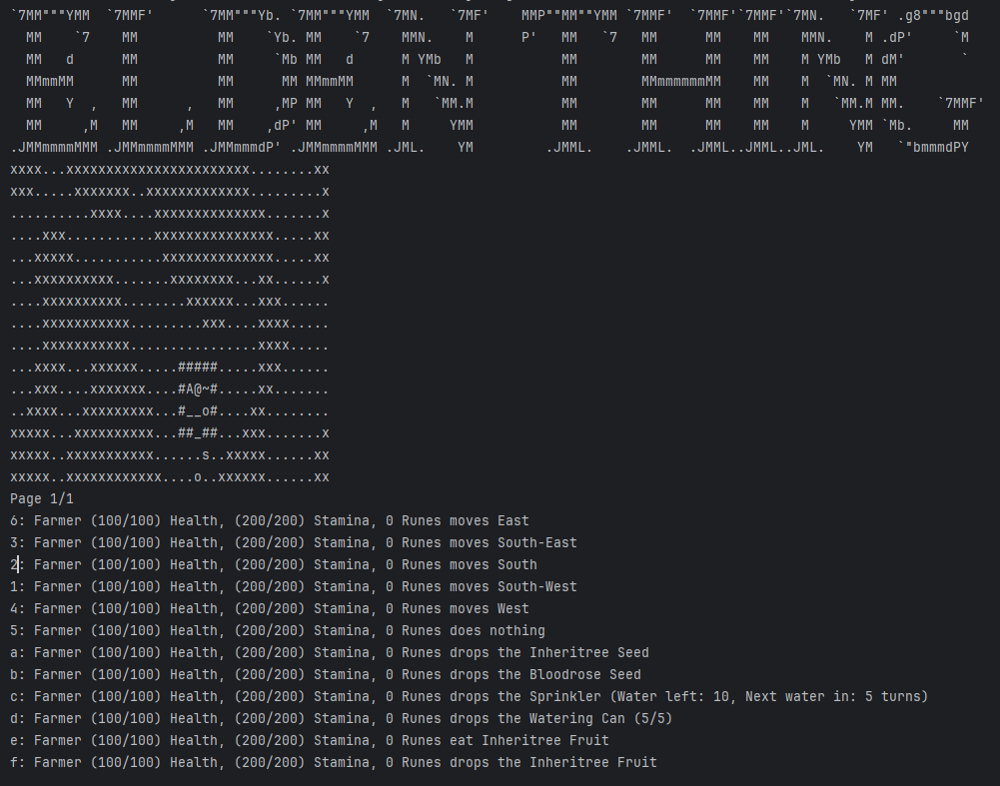
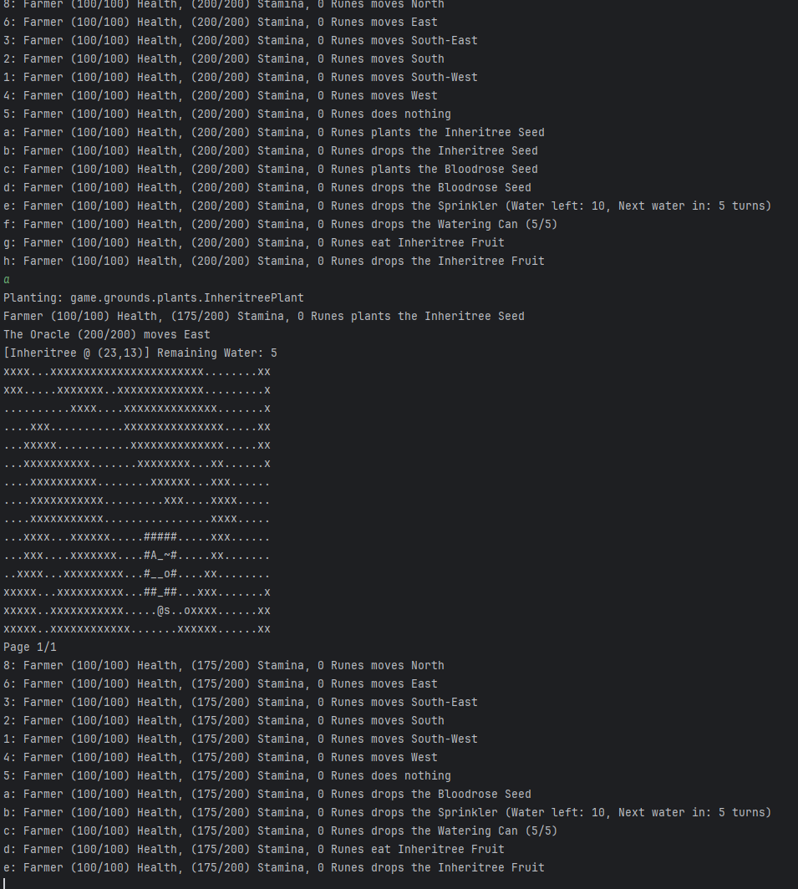
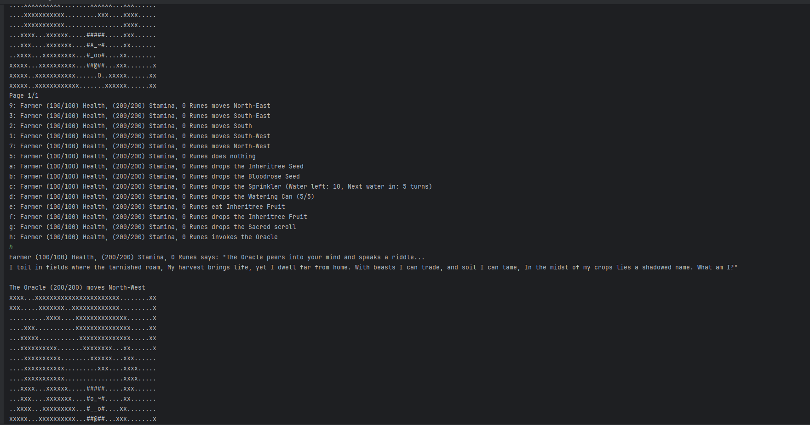
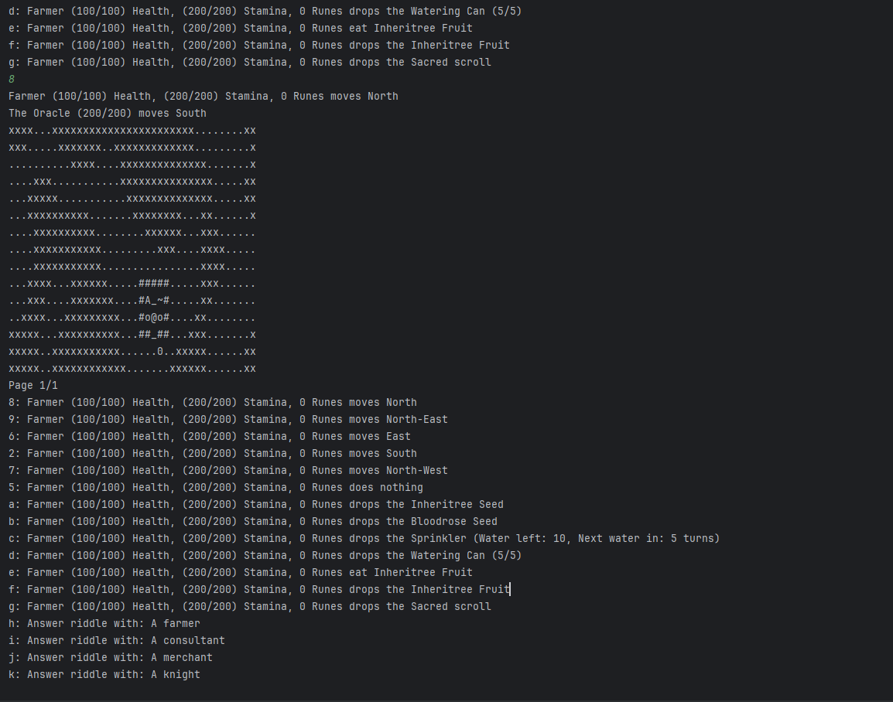
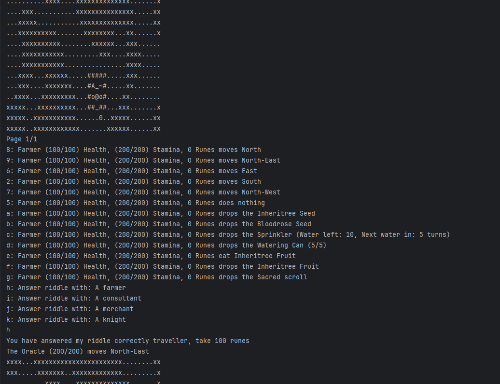

# Elden Thing — Java OOP Portfolio

A turn-based console RPG developed as a team project for **FIT2099 Object-Oriented Design and Implementation at Monash University**.

The project was built on top of a **Java game engine provided by Monash University**. Our team extended the engine through its existing abstractions such as `Actor`, `Action`, `Item`, `Ground`, `GameMap`, and `World` to implement additional gameplay systems including farming, NPC behaviours, trading, combat, multi-map exploration, boss mechanics, and an AI-powered Oracle.

> **Portfolio Notice**
>
> This repository is a portfolio showcase only.
> It does not publish the university-provided FIT2099 engine, the complete assessment source code, or the original assignment solution.

---

## Project Overview

**Elden Thing** is a turn-based Java game inspired by the Elden Ring universe.

Rather than rebuilding the underlying framework, the project focused on extending an existing engine while maintaining clear object-oriented boundaries.

Key systems include:

- Context-sensitive player actions
- NPC behaviours and decision strategies
- Farming and plant lifecycle management
- Manual and automatic watering
- Trading and rune-based economy
- Combat and hostile creatures
- Multi-map exploration
- Composite boss mechanics
- AI-generated Oracle dialogue and interactive riddles

---

## Tech Stack

- **Java 17**
- Object-Oriented Programming
- Strategy Pattern
- Interface-based capability modelling
- Composition and inheritance
- External API integration
- OpenAI API
- Git / GitHub

---

## Gameplay



The game runs as a turn-based console RPG on top of the FIT2099 game engine.

Each turn presents actions based on the current game state, nearby actors, terrain, and player inventory.

The interface displays:

- Current map
- Player health and stamina
- Rune balance
- Movement options
- Inventory
- Context-sensitive interactions

Instead of placing every interaction directly inside the player class, gameplay operations are represented through separate `Action` objects that become available when their conditions are satisfied.

Conceptually:

```text
Current Game State
        ↓
Available Actions
        ↓
Player Selects an Action
        ↓
Action.execute(...)
        ↓
Domain State Changes
```

This allows new interactions to be introduced without continuously expanding the responsibilities of the player or other actors.

---

## Farming System



The farming system demonstrates how player actions interact with persistent domain state.

When the Farmer reaches suitable ground while carrying a compatible seed, planting actions become dynamically available.

After planting an Inheritree Seed, the game:

1. Creates an `InheritreePlant`
2. Places the plant into the world
3. Deducts stamina from the Farmer
4. Tracks the plant's remaining water
5. Updates plant state as game turns progress

The plant lifecycle is separated from the player, allowing different plant types to share common behaviour while still supporting their own effects.

The watering system is also modelled independently through concepts such as:

- `WateringDevice`
- `ManualWateringDevice`
- `AutomaticWateringDevice`
- `WateringCan`
- `Sprinkler`

This keeps farming responsibilities distributed across focused domain objects rather than concentrating the entire system inside a single class.

---

## AI-Powered Oracle

One of the project's more experimental features is an Oracle that integrates an external language model into the turn-based game.

After obtaining the **Sacred Scroll**, the Farmer gains the capability required to interact with the Oracle.

The Oracle supports several dialogue modes, including:

- Prophecies
- Compliments
- Interactive riddles

The most important part of the design is that AI output is not treated only as text to print to the console.

For riddles, generated content is processed and converted into game state that can participate in the normal action system.

---

### 1. Generating a Riddle



When the Farmer invokes the Oracle, the game generates a prompt and sends it through the external API integration.

A riddle can then be generated dynamically and displayed as part of the Oracle interaction.

The game itself continues to control the player, world state, turn processing, and interaction rules.

---

### 2. Converting AI Output into Game State



After receiving the generated riddle, the response is processed by the Java application.

The riddle is represented as a domain object containing information such as:

- The riddle question
- Possible answers
- The correct answer

On the following turn, the stored riddle state is converted into multiple `RiddleAnswerAction` options.

For example:

```text
Answer riddle with: A farmer
Answer riddle with: A consultant
Answer riddle with: A merchant
Answer riddle with: A knight
```

This means the generated AI content becomes part of the application's interaction model rather than remaining isolated output.

---

### 3. Interactive Riddle Flow



The player can then select one of the generated answer actions through the same action system used by the rest of the game.

The overall interaction can be represented as:

```text
Farmer invokes Oracle
        ↓
DialogueGenerator
        ↓
ApiHandler
        ↓
OpenAI API
        ↓
Generated Response
        ↓
RiddleGenerator
        ↓
Riddle Domain Object
        ↓
RiddleAnswerAction
        ↓
Player Interaction
```

This creates a clear boundary between the external AI service and the core game domain.

The language model generates content, while the Java application remains responsible for:

- Game rules
- State management
- Turn processing
- Action availability
- Player interaction

---

## Architecture

A major challenge of the project was working within an **existing framework** rather than designing the entire application from scratch.

The FIT2099 engine already provided core abstractions such as:

```text
World
GameMap
Location
Actor
Action
Item
Ground
```

Our project-specific functionality extended these existing abstractions.

At a high level:

```text
FIT2099 Game Engine
        ↑
Engine Extension Points
        ↑
Game-Specific Domain Logic
        ↑
Gameplay Features
```

The game-specific modules include concepts such as:

```text
Game
│
├── Actions
├── Actors
├── Behaviours
├── Dialogue
├── Grounds
├── Items
├── Oracle
├── Statuses
├── Watering
├── Weapons
└── World
```

A high-level architecture overview is shown below.


More detailed documentation is available in:

- [`docs/architecture.md`](docs/architecture.md)
- [`docs/design-decisions.md`](docs/design-decisions.md)
- [`docs/reflection.md`](docs/reflection.md)

---

## Action-Based Interaction Design

Many gameplay interactions are represented as independent `Action` classes.

Examples include:

```text
AttackAction
BuyAction
SellAction
PlantAction
GrowAction
CureAction
EatAction
ReproduceAction
PropheciseAction
RiddleAnswerAction
RefillWateringCanAction
RefillSprinklerAction
```

Instead of requiring an actor to directly implement every possible interaction, the game determines which actions are currently available based on the surrounding state.

This provides a useful extension point for new gameplay mechanics.

For example:

```text
Farmer carries a seed
        +
Farmer stands on valid soil
        ↓
PlantAction becomes available
```

The same general interaction mechanism can therefore support combat, farming, trading, AI interaction, item usage, and other gameplay systems.

---

## NPC Behaviour Architecture

NPC decision-making is separated into reusable behaviour objects.

Examples include:

```text
AttackBehaviour
DeathBehaviour
FollowBehaviour
GrowBehaviour
MonologueBehaviour
ReproduceBehaviour
WanderBehaviour
```

Different algorithms can then be used to choose between available behaviours through a strategy abstraction:

```text
BehaviourSelectionStrategy
        │
        ├── PriorityBasedStrategy
        │
        └── RandomSelectionStrategy
```

This provided a practical use of the **Strategy Pattern**.

Instead of changing the NPC class whenever a different decision algorithm is needed, NPCs can use interchangeable behaviour-selection strategies.

This separates:

```text
What an NPC can do
```

from:

```text
How an NPC decides what to do
```

---

## Capability-Oriented Design

Some interactions depend on what an actor is capable of doing rather than on its concrete class.

Examples of capability-oriented concepts include:

```text
HostileAttacker
Reproducible
Harvestable
CAN_SPEAK_ORACLE
```

One example is the Oracle interaction.

Picking up the Sacred Scroll grants the capability required to communicate with the Oracle. Dropping the scroll removes that capability.

Conceptually:

```text
Pick up Sacred Scroll
        ↓
CAN_SPEAK_ORACLE added
        ↓
Oracle interaction becomes available

Drop Sacred Scroll
        ↓
CAN_SPEAK_ORACLE removed
        ↓
Oracle interaction becomes unavailable
```

This reduces unnecessary dependencies between specific actor implementations and interaction logic.

---

## Boss Composition

The **Bed of Chaos** boss demonstrates composition within the domain model.

Its structure includes concepts such as:

```text
BedOfChaos
│
└── BedOfChaosPart
    ├── Branch
    ├── Leaf
    └── GrowablePart
```

Instead of placing the entire boss mechanic inside one very large class, smaller components can carry their own state and behaviour while contributing to the larger boss system.

This was a useful example of preferring composition when modelling a complex entity made from collaborating parts.

---

## Multi-Map World

The project also extends the existing engine to support movement between multiple areas.

Rather than introducing a completely separate navigation mechanism, map transitions reuse the engine's existing concepts around:

```text
World
GameMap
Location
Actor
Movement
```

This helped keep world traversal consistent with the rest of the framework.

---

## Working with an Existing Framework

One of the most valuable aspects of the project was learning how to extend an unfamiliar codebase.

The project did not begin with a blank Java application.

The engine already defined:

- The application lifecycle
- Actor processing
- Turn execution
- Maps and locations
- Items and grounds
- Actions and interaction flow

New functionality therefore had to fit within existing extension points.

That required understanding the architecture before deciding where new responsibilities belonged.

A feature was not simply:

```text
Requirement
    ↓
Write a new class
```

It was closer to:

```text
Requirement
    ↓
Understand existing framework
    ↓
Identify extension point
    ↓
Determine responsibility
    ↓
Implement domain object
    ↓
Integrate with existing game loop
```

This experience made framework boundaries and responsibility allocation much more concrete than working only on applications designed from scratch.

---

## Design Principles

### Separation of Responsibilities

Actions, behaviours, actors, farming logic, dialogue generation, and API communication are separated into different components.

### Program to Abstractions

Interfaces and strategies are used where multiple implementations genuinely need to be interchangeable.

### Prefer Composition Where Appropriate

Complex systems such as the Bed of Chaos can be represented through collaborating components rather than one oversized class.

### Reuse Existing Extension Points

Existing engine concepts are reused instead of duplicating functionality already provided by the framework.

### Keep External Services Outside Core Domain Logic

The Oracle does not make the language model responsible for game rules.

The external service generates content, while the Java application remains responsible for interpreting that content and deciding how it affects game state.

---

## API Failure Handling

External services can fail independently of the game.

When revisiting the project, the Oracle interaction was tested against real API failure scenarios.

For example:

```text
OpenAI API unavailable
        ↓
No valid Oracle response
        ↓
Fallback response
        ↓
Game loop continues
```

This prevents an external API failure from terminating the entire game session.

It also reinforced an important architectural lesson:

> External integrations should fail at their boundary rather than allowing infrastructure failures to propagate unpredictably into domain logic.

---

## What I Learned

Working on this project changed how I thought about object-oriented design.

Initially, it was easy to view OOP mainly through classes, inheritance, and individual methods.

Extending an existing engine made other concepts much more important:

- Responsibility allocation
- Interfaces
- Behaviour composition
- Strategy-based decision making
- Persistent domain state
- Framework extension points
- Dependency boundaries
- External service integration

The project also demonstrated why design patterns should solve real variation rather than simply being added because a pattern exists.

For example, Strategy became useful because NPCs genuinely required different behaviour-selection algorithms.

Similarly, separating Actions from Actors became valuable because the number of possible interactions continued to grow.

---

## What I Would Improve Today

If revisiting the implementation further, several areas could be improved.

### Environment-Based Configuration

External credentials should be provided through environment variables rather than stored in source code.

For example:

```text
OPENAI_API_KEY
```

### Stronger API Abstraction

The external API client could sit behind an interface so it can be replaced or mocked without affecting Oracle domain logic.

```text
Oracle
    ↓
AIService interface
    ↓
OpenAI implementation
```

### Structured AI Responses

Using a structured response format would make generated riddles easier and safer to parse than relying on free-form text.

### Dependency Injection

Infrastructure dependencies such as external API clients could be injected rather than accessed directly.

This would improve:

- Testability
- Replaceability
- Separation of concerns

### Automated Testing

Additional automated tests could cover:

- Action availability
- NPC strategy behaviour
- Farming lifecycle transitions
- Watering state
- Riddle parsing
- External API failure handling
- Capability changes
- Multi-map transitions

---

## Portfolio Structure

```text
elden-thing-portfolio/
│
├── README.md
│
├── docs/
│   ├── architecture.md
│   ├── design-decisions.md
│   └── reflection.md
│
└── images/
    ├── architecture.png
    ├── gameplay.png
    ├── farming-demo.png
    ├── Oracle-demo1.png
    ├── Oracle-demo2.png
    └── Oracle-demo3.png
```

---

## Source Code Availability

The complete implementation is intentionally not included in this public portfolio repository.

The original project was completed as a Monash University assessment using a university-provided game engine.

To respect academic integrity and avoid redistributing provided course material, this repository focuses on:

- High-level architecture
- Design decisions
- Technical reflection
- Recreated diagrams
- Runtime demonstrations

The original assessment repository remains private.

---

## Project Context

| | |
|---|---|
| **Unit** | FIT2099 — Object-Oriented Design and Implementation |
| **University** | Monash University |
| **Project Type** | Team university project |
| **Language** | Java |
| **Runtime Demonstrated With** | Java 17 |
| **Primary Focus** | Object-Oriented Design and Framework Extension |

---

## Author

**Jichao(Mason) Liang**

Software Development student at Monash University.

GitHub: **MasonLLG**

---

## Disclaimer

The FIT2099 game engine used by this project was supplied by **Monash University** and was not authored by me.

This project was developed for educational purposes.

References to Elden Ring and related names are used in a non-commercial university project context. This portfolio project is not affiliated with or endorsed by FromSoftware or Bandai Namco Entertainment.