# Architecture Overview

## 1. Purpose

This document provides a high-level architectural overview of **Elden Thing**, a Java object-oriented game developed for FIT2099 at Monash University.

The original project was built on top of a **game engine provided by Monash University**.

The purpose of this portfolio document is not to reproduce the original assignment design or source code. Instead, it explains how the project-specific systems were structured around the extension points provided by the existing engine.

---

# 2. System Boundary

The original codebase contained two major layers:

```text
src/
│
├── edu/monash/fit2099/engine/
│   └── University-provided game engine
│
└── game/
    └── Project-specific implementation
```

The FIT2099 engine provided foundational abstractions such as:

* `Actor`
* `Action`
* `Item`
* `Ground`
* `Location`
* `GameMap`
* `World`
* `Display`

The project-specific `game` layer extended and composed these abstractions to implement the actual game domain.

A simplified dependency direction is:

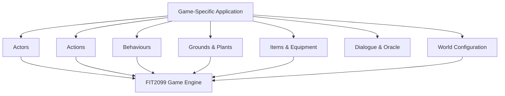

The project therefore depends on the engine rather than replacing it.

---

# 3. Project-Specific Modules

The game implementation was separated into several functional areas.

```text
game/
│
├── abilities/
├── actions/
├── actors/
├── behaviours/
│   └── strategy/
├── dialogue/
├── grounds/
│   └── plants/
├── items/
├── oracleutil/
├── statuses/
├── util/
├── watering/
├── weapons/
└── world/
```

Each package represents a separate area of responsibility.

This structure helped prevent the game from becoming a single collection of tightly coupled Actor classes.

---

# 4. Action-Based Interaction Model

A major extension point provided by the engine is the concept of an `Action`.

Rather than placing every possible interaction directly inside the player or NPC classes, project functionality was represented through specialised Action implementations.

Conceptually:

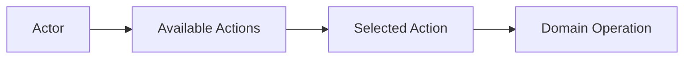

Examples of actions implemented by the project include concepts such as:

* attacking
* buying and selling
* planting
* growing
* eating
* curing
* reproducing
* refilling watering devices
* invoking the Oracle
* answering riddles

This design separates:

**who performs an operation**

from

**how the operation is executed**.

As new interactions are introduced, they can be represented as additional actions rather than continuously increasing the responsibility of Actor classes.

---

# 5. Actor Architecture

Actors represent entities that exist in the game world.

The project contains several categories of actors, including:

```text
Actor
│
├── Player
│
└── NonPlayerCharacter
     │
     ├── Interactive NPCs
     ├── Creatures
     ├── Hostile Actors
     └── Boss Entities
```

Different actors are given different capabilities and behaviours depending on their role.

Examples include:

* Farmer
* Merchant Kale
* Sellen
* Oracle
* Omen Sheep
* Spirit Goat
* Golden Beetle
* Guts
* Bed of Chaos

The architecture avoids requiring every actor to support every game feature.

Instead, specialised behaviour and capability abstractions are used where appropriate.

---

# 6. Behaviour Architecture

NPC decision-making logic is separated from the NPC entities themselves.

The project defines reusable behaviour concepts such as:

```text
AttackBehaviour
FollowBehaviour
WanderBehaviour
ReproduceBehaviour
GrowBehaviour
DeathBehaviour
MonologueBehaviour
```

A conceptual NPC architecture looks like:

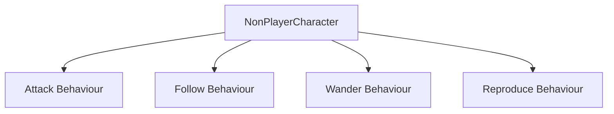

An NPC can therefore be composed from the behaviours appropriate to that actor.

This reduces the need for large NPC classes containing many unrelated decision branches.

---

# 7. Behaviour Selection Strategy

The project separates another responsibility from NPCs:

> How should an NPC select which available behaviour to execute?

This is represented through a strategy abstraction.

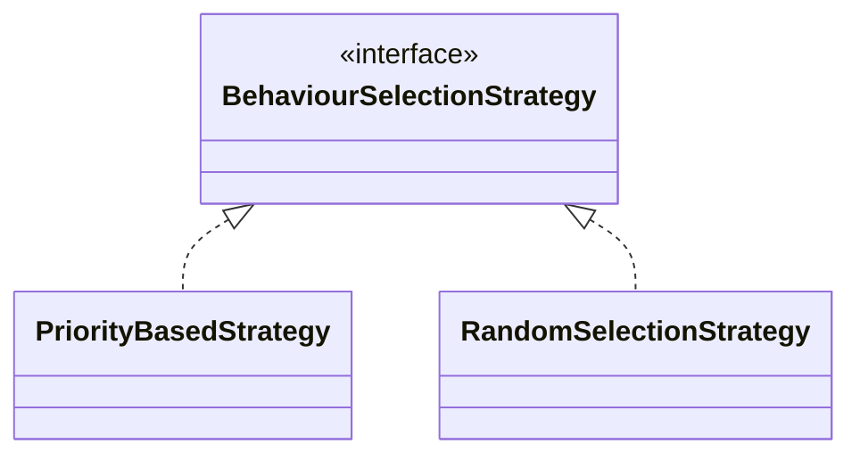

Two different decision approaches are supported:

### Priority-Based Selection

Available behaviours are evaluated according to priority and the most appropriate behaviour is selected.

### Random Selection

A behaviour is selected using a randomised strategy.

This allows the same general type of creature to use a different decision-making algorithm without rewriting the creature itself.

The architecture therefore separates:

```text
Actor
    ↓
Available Behaviours
    ↓
Behaviour Selection Strategy
    ↓
Selected Behaviour
    ↓
Action
```

This is one of the main applications of the **Strategy Pattern** in the project.

---

# 8. Farming Architecture

The farming system models land and plants as stateful domain objects.

At a high level:

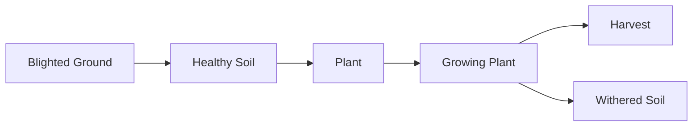

Important ground concepts include:

* `Blight`
* `Soil`
* `WitheredSoil`

Plants are represented through a shared plant abstraction with specialised plant implementations.

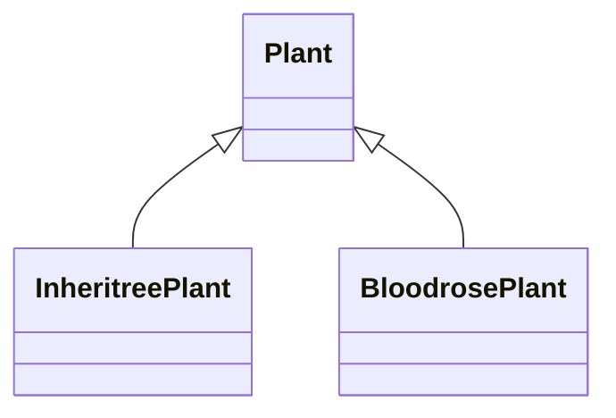

This allows common plant lifecycle behaviour to be shared while preserving plant-specific growth rules.

---

# 9. Watering Architecture

Watering is modelled separately from the plants themselves.

This avoids requiring plant classes to know how every watering tool works.

The high-level structure is:

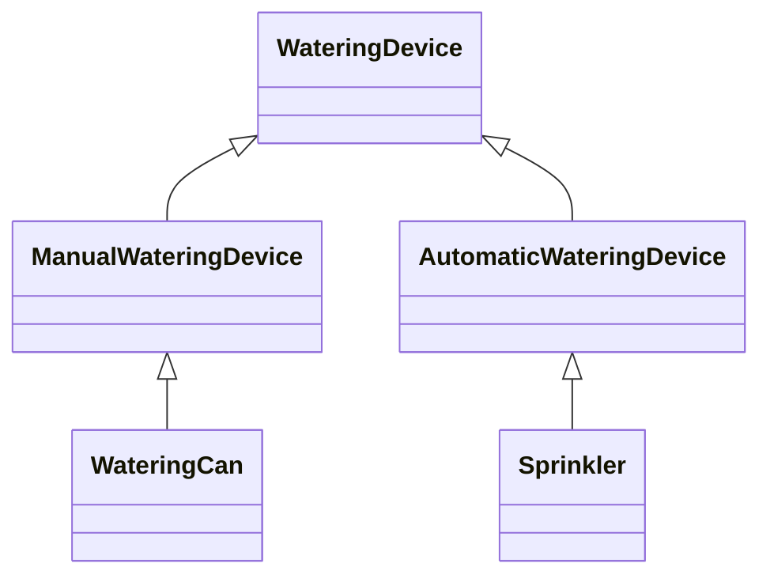

The design separates:

```text
Plant
"What needs water?"

from

WateringDevice
"How is water supplied?"
```

This makes the watering mechanism independently extensible.

For example, introducing another watering device should not require redesigning every plant implementation.

---

# 10. Oracle and External API Architecture

The Oracle is an interactive NPC connected to an external language model API.

The Oracle itself is not responsible for constructing every possible type of dialogue.

Instead, dialogue generation is abstracted behind a common interface.

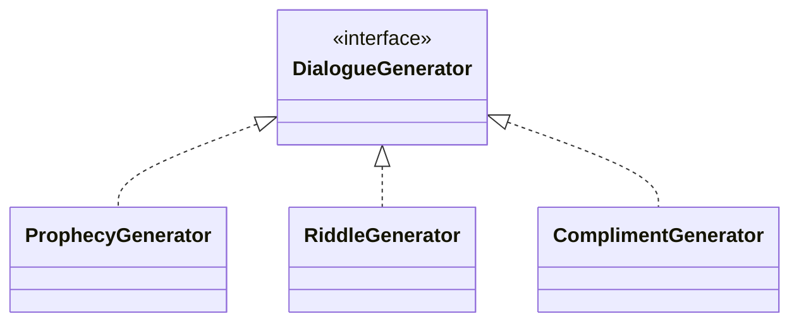

The interaction flow can be simplified as:

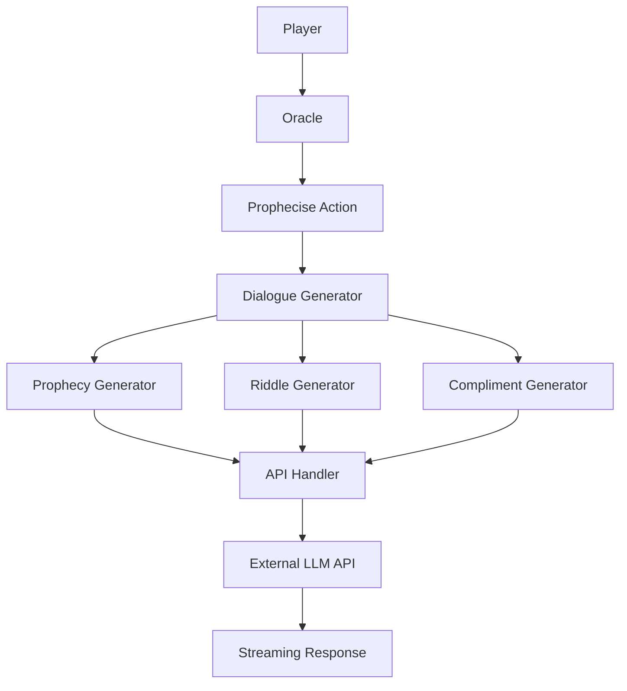

This separates three responsibilities:

### Oracle

Controls game interaction and Oracle state.

### DialogueGenerator

Defines how a particular type of dialogue should be generated and processed.

### ApiHandler

Handles communication with the external API.

---

# 11. Stateful Riddle Interaction

The Oracle's Riddle functionality introduces application state rather than simply displaying generated text.

A simplified flow is:

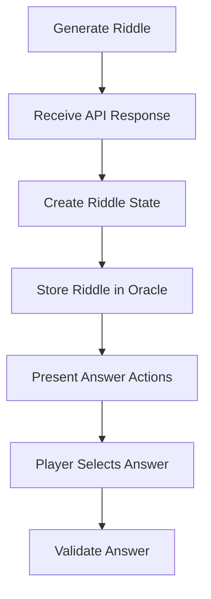

The generated content therefore participates in normal game mechanics.

This was an important design distinction:

```text
External API Output
        ↓
Application State
        ↓
Player Interaction
```

rather than:

```text
External API Output
        ↓
Print Text
        ↓
Discard
```

---

# 12. Multi-Map World Architecture

The game contains more than one map.

Examples include:

* Valley of the Inheritree
* Limveld

Movement between maps reuses the engine's existing map and movement abstractions.

At a high level:

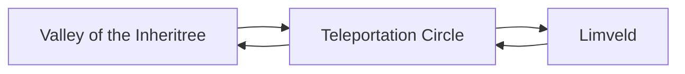

This demonstrates a general approach used throughout the project:

> Prefer extending existing framework abstractions before creating an entirely separate subsystem.

---

# 13. Boss Composition

The Bed of Chaos is modelled as a more complex entity composed of smaller parts.

Conceptually:

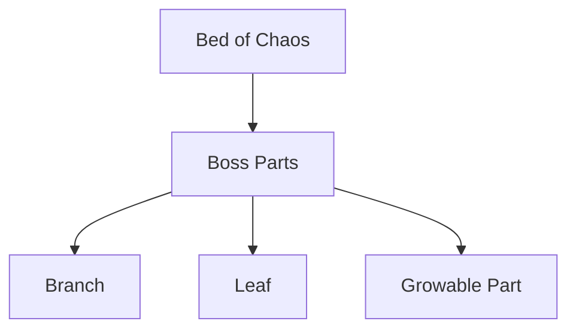

This demonstrates the use of **composition** to represent a complex entity.

Instead of placing every boss mechanic inside a single class, responsibilities can be distributed across collaborating parts.

---

# 14. Capability-Oriented Design

Some behaviours are better represented as capabilities rather than positions in a deep inheritance hierarchy.

Examples from the project include concepts such as:

```text
HostileAttacker
Reproducible
Harvestable
```

This allows game logic to ask:

> "Can this object perform this capability?"

rather than:

> "Is this object exactly this concrete class?"

This improves extensibility because unrelated classes can share a capability without requiring them to share the same concrete parent implementation.

---

# 15. Overall Runtime Flow

At a high level, the game runtime can be represented as:

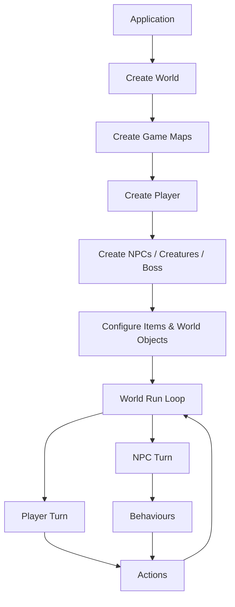

The main application is responsible primarily for assembling the game world.

Individual gameplay systems remain distributed among their respective domain classes.

---

# 16. Architectural Principles

Several principles became important as the project grew.

## Extend Existing Framework Abstractions

The provided engine already defined concepts such as Actor, Action and Ground.

New features were designed around those extension points instead of creating parallel systems unnecessarily.

---

## Separate Decision from Execution

For NPCs:

```text
Behaviour / Strategy
        ↓
"What should I do?"

Action
        ↓
"Perform the operation"
```

These responsibilities are kept separate.

---

## Separate Domain Concepts

For example:

```text
Plant
    → lifecycle and hydration

WateringDevice
    → mechanism for supplying water
```

and:

```text
Oracle
    → NPC interaction and state

DialogueGenerator
    → dialogue strategy

ApiHandler
    → external communication
```

---

## Prefer Polymorphism Over Large Conditional Structures

Shared abstractions allow different implementations to provide different behaviour while callers depend on the common interface.

---

## Use Composition for Complex Entities

The Bed of Chaos demonstrates how a complex game entity can be decomposed into collaborating objects.

---

# 17. Dependency Direction

A simplified view of the overall dependency direction is:

```text
Game Features
     │
     ▼
Game-Specific Abstractions
     │
     ▼
FIT2099 Engine Abstractions
```

External API integration follows a separate boundary:

```text
Game Domain
    │
    ▼
Dialogue Abstraction
    │
    ▼
API Adapter
    │
    ▼
External Service
```

The intention is to keep external infrastructure concerns from spreading throughout the game domain.

---

# 18. Key Architecture Lessons

Working on the project highlighted several software-design lessons.

### Understanding the existing framework comes first

New functionality is easier to integrate when the responsibilities and extension points of the existing codebase are understood first.

### Classes alone do not create good object-oriented design

The more important questions are:

* Who owns this responsibility?
* Which dependency should point to which abstraction?
* What behaviour is likely to change?
* Can that behaviour be replaced independently?

### Interfaces are useful when they represent meaningful variation

`BehaviourSelectionStrategy` and `DialogueGenerator` are valuable because multiple interchangeable implementations actually exist.

### Composition can be clearer than deeper inheritance

Complex objects such as the Bed of Chaos can be represented as collaborating parts instead of one increasingly large class.

### External systems should have a boundary

The OpenAI integration is isolated behind API and dialogue abstractions instead of being directly embedded throughout NPC logic.

---

# 19. Source Code Notice

This document intentionally describes the system only at a high architectural level.

The complete implementation is not included in this public portfolio because:

* the project was developed as a Monash University assessment;
* the underlying game engine was supplied by the university;
* the implementation contains team-developed assessment code.

This document is intended to demonstrate understanding of the system architecture without distributing the original assignment solution.

---

## Related Portfolio Documents

* [Project Overview](../README.md)
* `design-decisions.md` — detailed discussion of selected design choices
* `reflection.md` — technical reflection and lessons learned
